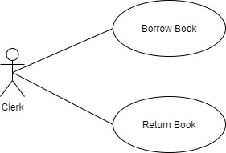

# Library TS Node Backend
A simple library backend using clean architecture principles and other best practices.

## Preface

The idea of this exercise is to apply some of the well known best practices and design a simple application using clean architecture (CA) principles.  I have done some research online but most of the examples I have seen only covers very small fraction of the CA principles and dont talk about how to tackle complex question that arise when building an enterprise application. For these reasons I have decided to build this application from scrath to finish. This is also done to reinforce my understanding about those practices.

By no means this exercise is completely correct and there are things that can improve and there can be things I have understood wrong. I hope this will give you a glimpse into my thought process and give you a different perspective approaching CA or help you improve your understanding overall aproaching developement.

## Business & System Requirement

The hypothetical business requirement is to provide the functionality to **borrow** and **return** books by customers. The UI implementation is not as of a concern, rather we need some sort of an API that will do the borrowal and return process.

## Design Discussion

### 1. Have Application broken into 3 layers (Domain, Use Case/ Application, Infra) And follow the dependency rule

This is by design what clean architecture talks about. Have domain rules and policy of what we are trying to model have at the center. Have application layer followed by that which handles application policy that facilitate the domain requirements. At the outermost layer we have the infrastructure layer that connects to things like Database, ORM, Web Frameworks. The layers could have been separate projects, [Lerna](https://lerna.js.org/) can help.

This project could have been completed much easily if the purpose was to implement these features only by not having clear separation of layers. But the point of this exercise is to apply CA and have its benefits in the long run.

[Read more about CA](https://blog.cleancoder.com/uncle-bob/2012/08/13/the-clean-architecture.html)

### 2. Model Domain 1st, Use Cases and then Infra

This is to reduce any bias of having data driven modelling or framework driven application design when developing the application. By following this practice, you get the opportunity to properly model the business/domain policy and use unit testing or TDD/BDD to throughly test that and move to upper layers.

### 3. Domain or Use Case Layer is not aware of ORM. 

Use Case Layer define interfaces asking to store and retrive things but doesnt say who or how its need to be done. It can be an API, Database or a simple file. With this you are going to run into some problems like How am I going to enforce transactional integrity? UOW pattern. Define an interface in Use Case Layer encapsulating that everything defined in the interface must happen or roll back together. How its implemented by a Relation or NoSQL database is a detail of the infrastrucutre layer.

### 4. There is a Domain Model (Domain Entities) and There is a Persistence Model (Persistence Entities of TypeORM). They are not the same. Also

This is done by design to remove,

1. Object–relational impedance mismatch
2. Coupling application code to database model/ database type (Relational, Non Relational Etc.)

### 5. Proper interface definitions and error handling

The code is structured by placing interfaces between contractual elements so unit testing can be a first class citizen. Interface explain what it expects from the implementor of the interface and they are seggregated. Also, Error handling is not an after thought rather part of the interfaces explaning that all the outcomes so you know what to expect and code how to react to them properly.

### 6. Database Migrations are source controlled

Database migrations are properly versioned and source controlled. This is to make sure that data model stays universally the same through the pipline from development to proudction and will not endup with surprises.

### 7. Database only contain relevant data

If you look at the database, you will see that there are only relevant data for our application purposes. for instance, books table only contain a table with book id column, not even the book name is preserved. This is objectively building our applcation around the domain of borrowing and returning books. If we need to have the feature to add and update books, you must look if its within the same domain. It's not, hence a separate microservice. How do we keep the book addition and updates in sync? In very brief terms, by using domain events passing what happened in that application and reacting to that in this application.

## FAQ

- Where is the web framework? Where is the API? How can I run this?
  
  In the works. Right now my focus is on core functionality as I have explained in the design discussion. Once that is done, I will be moving to infrastructure layer to solve this. You can run this when that happens or you can try providing the necessary inputs to a use case class and run it dry (I'm haven't tested completely yet so there could be errors). On a side note, You can see that how frameworks have become an after thought as they should be.

- Can you really keep persistence and domain model completely separate?
  
  No. There are instances whre you will have to leak some persistence elements like keys to domain model to allow persistence to work correctly. For example, I had to introduce a borrowal id into the domain to make sure that persistence layer can properly defferentiate rows in customer_borrowals table. But this can be kept minimum so sepraation between layers are optimal.

- What if a customer or a book got disabled?
- Why domain, use case and infra layers are in a single project?
- What if I wanted to list down books that are not borrowed in frontend, How would I achieve that?
- Why Prisma was not used?
  - Alpha and Beta features
  - Have weak support for views at the moment
  - Weak Query Capabilities at the moment
- Why TypeORM is used? Where are the general repos?

## TODO

- Remove configuration files like (.env .conf.js) files from source control and have them avilable through env variables
- Logging as events
- Complete The Api / Select a suitable Web Framwork
- Complete FAQ
- Complete Unit Testing